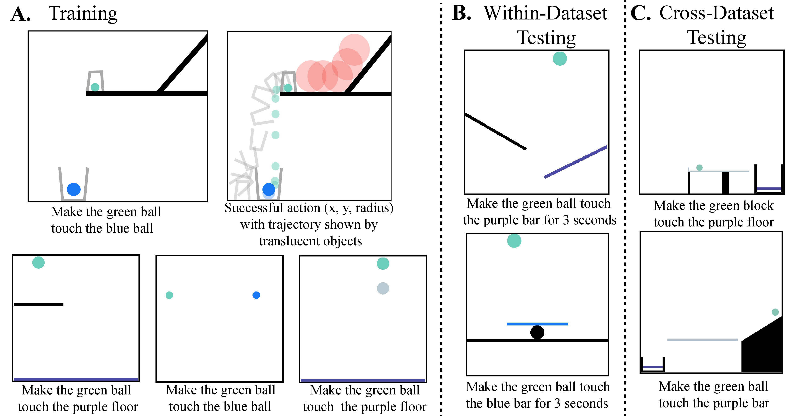

# OGRE dataset

Contains code to reproduce agent baselines from  OGRE dataset (Add link!).

## Abstract
If an agent understands how to reason about some objects, can it generalize this understanding to new objects that it has never seen before?
We propose the Object-based Generalization for Reasoning Environment (OGRE) for testing object generalization in the context of \emph{creative reasoning} and \emph{efficient acting}.
OGRE emphasizes evaluating agents by how efficiently they solve novel creative reasoning tasks, not just how well they can predict the future.
OGRE provides two levels of generalization: generalization over reasoning strategies with familiar objects, and generalization over new object types that still share similar material properties to those in training.
We run three baseline agents on OGRE, showing that an image-based deep Q network can learn reasoning strategies that generalize in a limited way across familiar object types, but does not generalize at all to new object types.
We hope OGRE will encourage advances in building object representations that more explicitly enable reasoning and planning  compared to previous benchmarks.

## Agents

Cross-dataset generalization is implemented as a generaralization tier in PHYRE framework referred to as `ball_phyre_to_tool`. Please see the [API documentaion](https://phyre.ai/docs/evaluator.html) for more details.

We provide code that runs the baselines from PHYRE dataset and also newly added Object-Oriented Random Agent on cross-template and cross-dataset settings.
To launch all evals simply run `python agents/run_experiments_ogre.py`.
To train DQN models for the eval, see PHYRE's [README](README.md).
